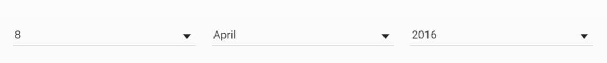
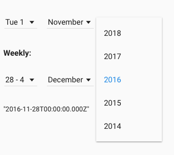
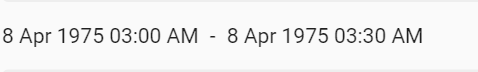
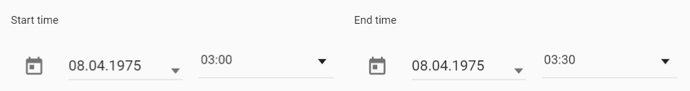

# Pip.WebUI.Controls User's Guide

## <a name="contents"></a> Contents
- [Installing](#install)
- [pip-color-picker directive](#color_picker)
- [pip-date directive](#date)
- [pip-time-range directive](#time_range)
- [pip-time-range-edit directive](#time_range_edit)
- [pip-image-slider directive](#image_slider)
- [pip-markdown directive](#markdown)
- [pip-popover directive](#popover)
- [pip-routing-progress directive](#routing_progress)
- [pip-refresh-button directive](#refresh_button)
- [pip-tag-list directive](#tag_list)
- [pip-toggle-buttons directive](#toggle_buttons)
- [pipToasts service](#toasts)
- [pipInformationDialog](#information_dialog)
- [pipConfirmationDialog](#confirmation_dialog)
- [pipErrorDialog](#error_dialog)
- [pipOptionsDialog](#error_dialog)
- [Questions and bugs](#issues)


## <a name="install"></a> Installing

Add dependency to **pip-webui** into your **bower.json** or **package.json** file depending what you use.
```javascript
"dependencies": {
  ...
  "pip-webui": "*"
  ...
}
```

Alternatively you can install **pip-webui** manually using **bower**:
```bash
bower install pip-webui
```

or install it using **npm**:
```bash
npm install pip-webui
```

Include **pip-webui** files into your web application.
```html
<link rel="stylesheet" href=".../pip-webui-lib.min.css"/>
<link rel="stylesheet" href=".../pip-webui.min.css"/>
...
<script src=".../pip-webui-lib.min.js"></script>
<script src=".../pip-webui.min.js"></script>
```

Register **pipControls** module in angular module dependencies.
```javascript
angular.module('myApp',[..., 'pipControls']);
```

## <a name="color_picker"></a> pip-color-picker directive

**pip-color-picker** directive allows to select a color from predefined pallette.

### Usage
```html
<pip-color-picker ng-model="color" ng-disabled="disabled" pip-colors="colors">
</pip-color-picker>
```


See online sample [here...](http://webui.pipdevs.com/pip-webui-controls/index.html#/color_picker)

### Attributes
* **pip-colors** - colors array

## <a name="date"></a> pip-date directive

**pip-date** directive allows to set a date using 3 comboboxes for day, month and year.

### Usage
```html
<pip-date pip-time-mode="past" ng-model="specialDate"
          ng-change="changeFunction" ng-disabled="false">
</pip-date>
```



### Attributes
* **pip-time-mode** - interval of time for forming of dates (past, future). By default not set.

## <a name="date_range"></a> pip-date-range directive

**pip-date-range** directive allows to pick a specific date range on daily, weekly, monthly or yearly time interval. 
This control can be helpful in various calendars and planning tools.

### Usage
```html
<pip-date-range pip-date-range-type="daily" ng-model="daily"
                pip-no-line="false"></pip-date-range>
```



See online sample [here...](http://webui.pipdevs.com/pip-webui-controls/index.html#/date)

### Attributes
* **pip-date-range-type** - interval of time for forming of dates (daily, weekly, yearly)
* **pip-no-line** - boolean attribute. If pip-no-line equal true add class 'pip-no-line'. By default equal false

## <a name="time_range"></a> pip-time-range directive

**pip-time-range** directive visualizes specific time interval

### Usage
```html
<pip-time-range pip-start-date="startDate" pip-end-date="endDate" pip-rebind="true"></pip-time-range>
```



See online sample [here...](http://webui.pipdevs.com/pip-webui-controls/index.html#/tags)

### Attributes
* **pip-start-date** - first date
* **pip-end-date** - second date

## <a name="time_range_edit"></a> pip-time-range-edit directive

**pip-time-range-edit** directive allows to specify time interval rounded to days or half-hour chunks

### Usage
```html
<pip-time-range-edit pip-start-date="startDate" pip-end-date="endDate"></pip-time-range-edit>
```



See online sample [here...](http://webui.pipdevs.com/pip-webui-controls/index.html#/tags)

### Attributes
* **pip-start-date** - start date
* **pip-end-date** - end date

## <a name="image_slider"></a> pip-image-slider directive

**pip-image-slider** directive creates an interactive image carusel with smooth animations. It is usually used on landing or guidance screens.

### Usage
```html
<div pip-image-slider pip-animation-type="'fading'" class="w-stretch" pip-animation-interval="5000">
     <div class="pip-animation-block w-stretch" ng-repeat="image in images">
         
     </div>
</div>
```


See online sample [here...](http://webui.pipdevs.com/pip-webui-controls/index.html#/image_slider)

### Attributes
* **pip-animation-type** - type of animation (carousel, fading)
* **pip-animation-interval** - interval animation in ms. By default equal 4500 ms

## <a name="markdown"></a> pip-markdown directive

**pip-markdown** directive visualizes hypertext formated as markdown and converted int HTML.

### Usage
```html
<pip-markdown pip-text="text" pip-rebind="true" pip-line-count="5"></pip-markdown>
```


See online sample [here...](http://webui.pipdevs.com/pip-webui-controls/index.html#/markdown)

### Attributes
* **pip-text** - text object
* **pip-line-count** - max number of lines for a display
* **pip-rebind** - binding field pip-text. By default equal false

## <a name="popover"></a> pip-popover directive

**pip-popover** directive provides nice looking popovers with achors. Usually that control is used for context guidance.

### Usage
```javascript 
pipPopover.show({
   class: 'pip-tip',
   locals: {
       title: $scope.title,
       content: $scope.content
   },
   cancelCallback: function () {
       console.log('backdrop clicked');
   },
   controller: 'customController',
   template: 'custom.html'
});
```


See online sample [here...](http://webui.pipdevs.com/pip-webui-controls/index.html#/popover)

### Methods
* **show** - open popover

## <a name="routing_progress"></a> pip-routing-progress directive

**pip-routing-progress** directive shows animated ring with a logo inside. It is used in page transitions and initial application loading.

### Usage
```html
<pip-routing-progress></pip-routing-progress>
```


See online samples [here...](http://webui.pipdevs.com/pip-webui-controls/index.html#/progress)

## <a name="refresh_button"></a> pip-refresh-button directive

**pip-refresh-button** shows at the top of the screen when new data is available. By clicking on it, user triggers the update. It is used as a visual confirmation of he data arrival and helps to manager user expectations.

### Usage
```html
<pip-refresh-button pip-text="refreshText" pip-visible="showRefresh" pip-refresh="onRefresh()">
</pip-refresh-button>
```


See online samples [here...](http://webui.pipdevs.com/pip-webui-controls/index.html#/refresh)

### Attributes
* **pip-text** - string to display text in refresh toast 
* **pip-refresh** - function for updating string

## <a name="tag_list"></a> pip-tag-list directive

**pip-tag-list** directive visializes a list of read-only chips (tags)

### Usage
```html
<pip-tag-list pip-tags="tags"
              pip-type="type"
              pip-type-local="typeLocal"
              pip-rebind="true">
</pip-tag-list>
```


See online samples [here...](http://webui.pipdevs.com/pip-webui-controls/index.html#/tags)

### Attributes
* **pip-tags** - array of tags
* **pip-type** - string for type chips
* **pip-type-local** - string to display type chips
* **pip-rebind** - binding pip-tags array. By default equal false

## <a name="toggle_buttons"></a> pip-toggle-buttons directive

**pip-toggle-buttons** directive implement multiple radio buttons. Only one of them can be pressed at any time. On phones buttons are replaced with dropdown list.

### Usage
```html
<pip-toggle-buttons ng-model="activeButton"
                    pip-rebind="true"
                    pip-buttons="buttonsCollection">
</pip-toggle-buttons>
```


See online samples [here...](http://webui.pipdevs.com/pip-webui-controls/index.html#/toggle_buttons)

### Attributes
* **buttonsCollection** - array buttons 
* **pip-rebind** - binding buttonsCollection array. By default equal false

## <a name="toasts_service"></a> pipToasts service

**pipToast** services allows to show toast messages, formatted in different ways and presented in priority order. It ensures that one toast message will not hide another one, until timeout expires or users handles it.

### Usage
```javascript
thisModule.controller('ToastsController',
  function (pipToasts) {
  
     pipToasts.showNotification('Do you want accept goal?', ['accept', 'reject']);
     ...
     var error = {
           path: '/api/1.0/parties/:id/followers',
           method: 'POST',
           code: 400,
           name: 'Bad Request',
           error: 1402,
           message: 'Missing party information'
     };
     pipToasts.showError(error.message, null, null, null, error);
 });
```


See online samples [here...](http://webui.pipdevs.com/pip-webui-controls/index.html#/toasts)

### Methods
* **showNotification** - show toast with notification message and actions
* **showMessage** - show toast with notification message 
* **showError** - show toast with error message
* **hideAllToasts** - hide all toasts in queue
* **clearToasts** - delete all toasts in queue
* **removeToastsById** - delete toast in queue when id toast equal id in params
* **getToastById** - return data toast by id

## <a name="information_dialog"></a> pipInformationDialog

**pipInformationDialog** show dialog with information message and OK button.

### Usage
```javascript
 pipInformationDialog.show(
        {
            event: event,
            title: 'Good!',
            message: 'Stuff %s was really good',
            item: 'Loooooong naaaaaaaaaaaaaame',
            ok: 'Take It'
        },
        function () {
            console.log('Taken');
        }
    );
```


### Methods
* **show** - open information dialog

## <a name="confirmation_dialog"></a> pipConfirmationDialog

**pipConfirmationDialog** shows message with question and YES and NO buttons.

### Usage
```javascript
 pipConfirmationDialog.show(
        {
            event: event,
            title: 'Agree?',
            ok: 'Agree',
            cancel: 'Disagree'
        },
        function () {
            console.log('You agreed');
        },
        function () {
            console.log('You disagreed');
        }
    );
```

### Methods
* **show** - open confirmation dialog

## <a name="error_dialog"></a> pipErrorDialog

**pipErrorDialog** shows error message with collapsible details.

### Usage
```javascript
 pipErrorDetailsDialog.show(
     {
         error: $scope.error,
         ok: 'Ok'
     },
     function () {},
     function () {}
 );
```


### Methods
* **show** - open errors details dialog

## <a name="options_dialog"></a> pipOptionsDialog

**pipOptionsDialog** allows to pick one from several available options.

### Usage
```javascript
 pipOptionsDialog.show(
        {
            event: event,
            title: 'Choose Option',
            options: [
                { icon: 'star', name: 'option_1', title: 'Option 1', active: true },
                { icon: 'star', name: 'option_2', title: 'Option 2' },
                { icon: 'star', name: 'option_3', title: 'Option 3' },
                { name: 'option_4', title: 'Option 4' },
                { name: 'option_5', title: 'Option 5' }
            ]
        },
        function(option) {
            var optionName = option ? option.name : null;
            console.log('Selected option: ' + optionName);
        }
    );
```


### Methods
* **show** - open options dialog

## <a name="issues"></a> Questions and bugs

If you have any questions regarding the module, you can ask them using our 
[discussion forum](https://groups.google.com/forum/#!forum/pip-webui).

Bugs related to this module can be reported using [github issues](https://github.com/pip-webui/pip-webui-controls/issues).
